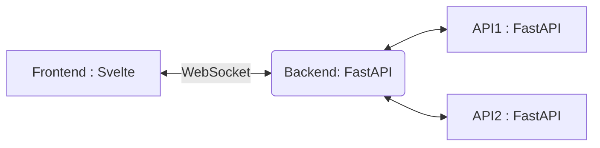

<a name="readme-top"></a>
<div align="center">
  <h1 align="center">Image Processing GUI</h3>
  <p align="center">
    GUI template for image processing.
    <br />
  </p>
</div>

<!-- ABOUT THE PROJECT -->
## About The Project

**Image Processing GUI** is a modern and efficient platform designed to streamline the process of image manipulation. With the ability to upload images via the frontend, our system seamlessly sends these images through a backend server to an API server, where all the magic happens. Here's a glimpse of what sets us apart:
<br />
<br />
**High-speed Processing:** Even when multiple images are uploaded, we guarantee swift processing. This is made possible by parallelizing the communication from our backend to the API server.



### Technology Stack:


**Frontend:** Built using the lightweight and powerful svelte. <br /> <br />
**Backend & API:** Developed with the high-performance, Python-based web framework FastAPI. <br /> <br />
**Real-time Communication:** We employ websockets to ensure real-time, bidirectional communication between the frontend and backend. This not only enhances user experience but also allows for chunked image transmission, making it possible to handle large images without a hitch. <br /> <br />

Whether you're a user looking for fast image processing or a developer interested in a solid stack, Image Processing GUI has got you covered.

https://github.com/fightingsou/Image-Processing-GUI/assets/104222305/a2a94580-1142-4b28-8a4a-6fb6d0eb09e6

<p align="right"><a href="#readme-top">↑</a></p>

## Usage
Execute the following command in an environment where `docker-compose` command is available.

  ```sh
  docker-compose up -d
  ```

## License

Distributed under the MIT License. 
